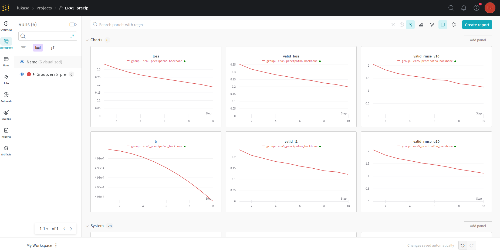
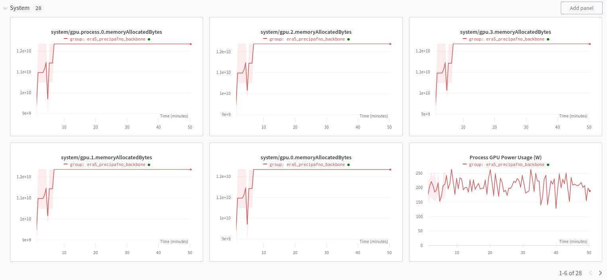
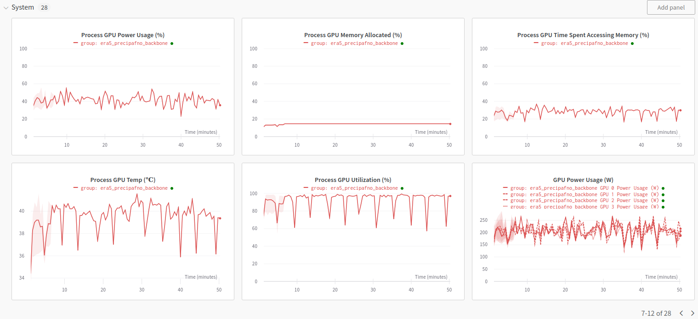
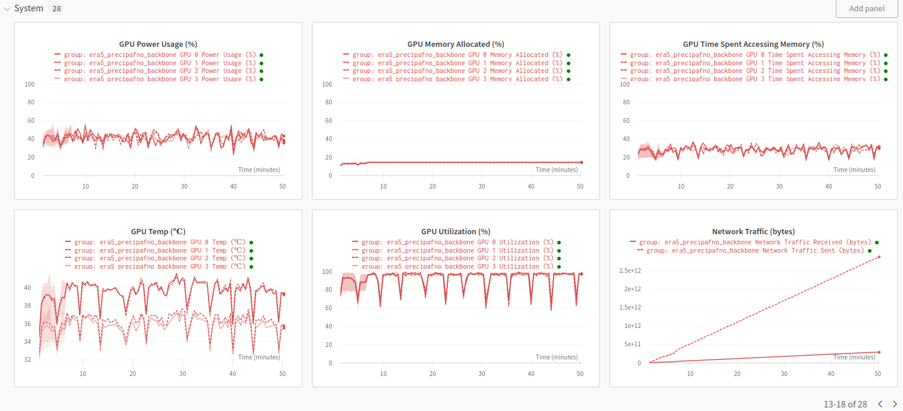
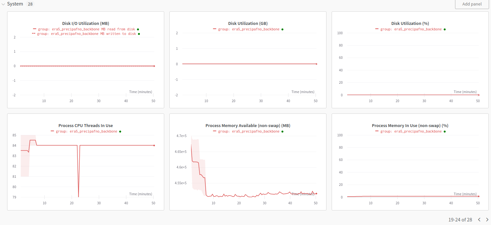
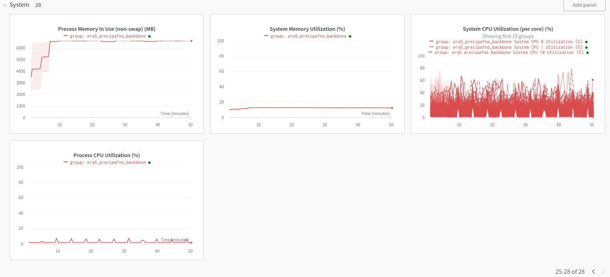

# FourCastNet with the Container CE on Clariden

Follow these instructions to run this application in Clariden.

### Build the Docker image

On a machine with `docker` installed, change to the `docker` directory and run `build.sh` to build and push the Docker image to Docker hub.


### Pull the Docker image on Clariden

Pull the container image in the home directory using `enroot`

```
lukasd@clariden-ln001:~> srun enroot import docker://lukasgd/fcn-nvidia-pytorch:22.04-py3
[INFO] Querying registry for permission grant
[INFO] Authenticating with user: <anonymous>
[INFO] Authentication succeeded
[INFO] Fetching image manifest list
[INFO] Fetching image manifest
[INFO] Downloading 5 missing layers...
[INFO] Extracting image layers...
[INFO] Converting whiteouts...
[INFO] Creating squashfs filesystem...
Parallel mksquashfs: Using 64 processors
Creating 4.0 filesystem on /users/lukasd/lukasgd+fcn-nvidia-pytorch+22.04-py3.sqsh, block size 131072.

Exportable Squashfs 4.0 filesystem, zstd compressed, data block size 131072
        uncompressed data, compressed metadata, compressed fragments,
        compressed xattrs, compressed ids
        duplicates are removed
Filesystem size 17852956.71 Kbytes (17434.53 Mbytes)
        83.95% of uncompressed filesystem size (21265005.19 Kbytes)
Inode table size 2823796 bytes (2757.61 Kbytes)
        24.03% of uncompressed inode table size (11751088 bytes)
Directory table size 3911314 bytes (3819.64 Kbytes)
        35.91% of uncompressed directory table size (10892797 bytes)
Number of duplicate files found 48017
Number of inodes 345079
Number of files 310279
Number of fragments 16655
Number of symbolic links  1654
Number of device nodes 0
Number of fifo nodes 0
Number of socket nodes 0
Number of directories 33146
Number of ids (unique uids + gids) 1
Number of uids 1
        root (0)
Number of gids 1
        root (0)
```

The image is stored in a `.sqsh` file.
```
lukasd@clariden-ln001:~> ls -l lukasgd+fcn-nvidia-pytorch+22.04-py3.sqsh
-rw-r-----+ 1 lukasd csstaff 18281463808 Okt 26 19:46 lukasgd+fcn-nvidia-pytorch+22.04-py3.sqsh
```

### Environment definition files

Use an environment definition file (EDF) in TOML format to specify the container runtime environment. This requires the absolute path to the `.sqsh` file.  
```
lukasd@clariden-ln001:~> realpath lukasgd+fcn-nvidia-pytorch+22.04-py3.sqsh
/users/lukasd/lukasgd+fcn-nvidia-pytorch+22.04-py3.sqsh
```

Change to the application directory and edit the TOML file.
```
lukasd@clariden-ln001:~> cd /iopsstor/scratch/cscs/lukasd/FourCastNet/
lukasd@clariden-ln001:/iopsstor/scratch/cscs/lukasd/FourCastNet> vim env/lukasgd-fcn-nvidia-pytorch-22.04.toml
lukasd@clariden-ln001:/iopsstor/scratch/cscs/lukasd/FourCastNet> cat env/lukasgd-fcn-nvidia-pytorch-22.04.toml
image = "/users/lukasd/lukasgd+fcn-nvidia-pytorch+22.04-py3.sqsh"
mounts = ["/iopsstor/scratch/cscs/dealmeih:/iopsstor/scratch/cscs/dealmeih",
          "/iopsstor/scratch/cscs/lukasd:/iopsstor/scratch/cscs/lukasd",
          "/users/lukasd:/users/lukasd"]
workdir = "/iopsstor/scratch/cscs/lukasd/FourCastNet"
```
### Running the application through SLURM

Launch the application asynchronously with SLURM using sbatch.
```
lukasd@clariden-ln001:/iopsstor/scratch/cscs/lukasd/FourCastNet> sbatch submit_batch.sh
```

Follow the logs using
```
lukasd@clariden-ln001:/iopsstor/scratch/cscs/lukasd/FourCastNet> tail -f slurm-afno.*.out
...
2023-10-26 21:44:42,443 - root - INFO - Time taken for epoch 1 is 268.29315757751465 sec
2023-10-26 21:44:42,444 - root - INFO - Train loss: 0.3334257900714874. Valid loss: 0.3517494797706604
2023-10-26 21:49:04,001 - root - INFO - Time taken for epoch 2 is 261.5571141242981 sec
2023-10-26 21:49:04,002 - root - INFO - Train loss: 0.30556416511535645. Valid loss: 0.3189866542816162
2023-10-26 21:53:24,859 - root - INFO - Time taken for epoch 3 is 260.8574433326721 sec
2023-10-26 21:53:24,860 - root - INFO - Train loss: 0.28170695900917053. Valid loss: 0.2993544936180115
...
```

and inspect the convergence of the distributed training on your wandb.ai space








